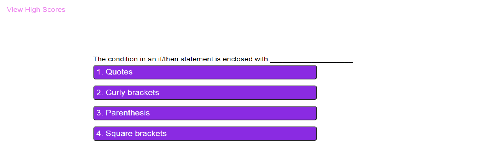

# Coding Quiz

[LINK TO APPLICATION](https://cjacktwil.github.io/coding-quiz/)

## Description
This application utilizes css and JavaScript to provide a web development coding quiz. 

## Functionality

When the Start button is clicked, the first question, along with multiple-choice answer buttons appear. A timer is set to count-down from 75 seconds. If the correct answer is selected by mouse click, the user gains one point. If the incorrect answer is selected, the time decreases by 10 seconds.

The quiz concludes when all questions have been answered. A score is generated and the user is prompted to enter his/her initials.

If the user's score is a high score, the score and initials will be stored in local storage and displayed on the High Score page. 

